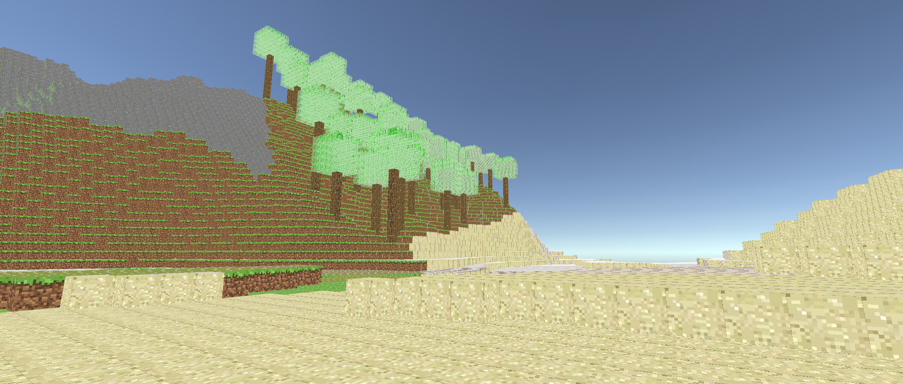
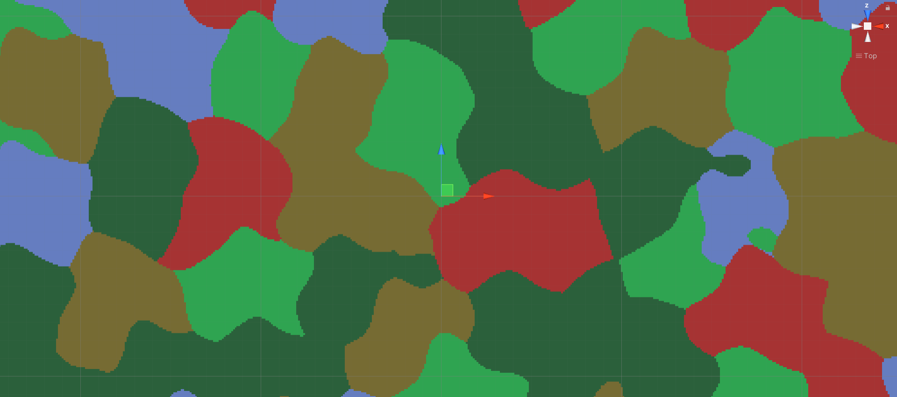
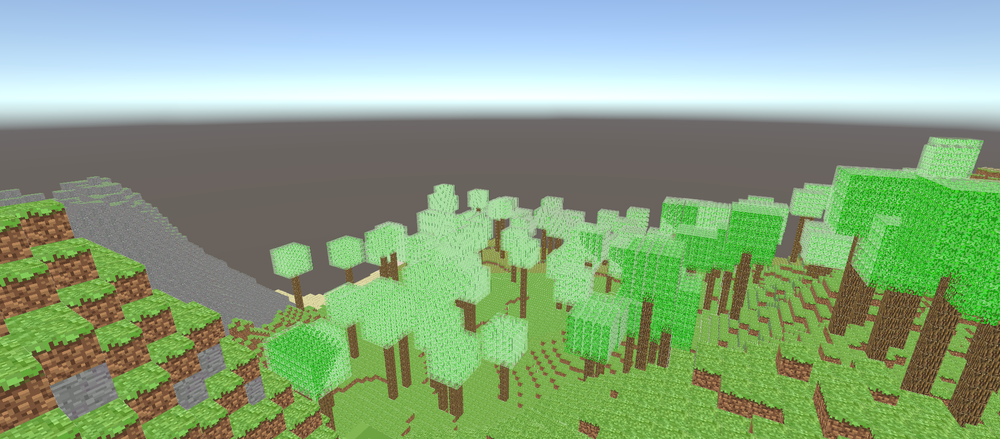
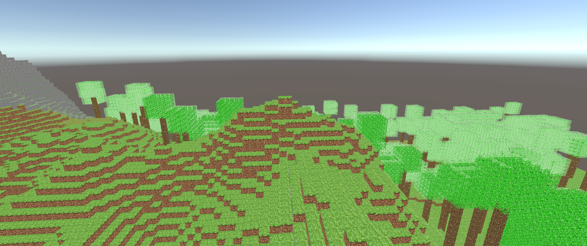

# TerrainGeneration
Procedural terrain generation in unity

By [Alex Kristev](https://github.com/kristevalex)  

## Folders in repository

* [TerrainGeneration](#s-TerrainGeneration)
* [Minecraft](#s-Minecraft)

##  TerrainGeneration
Here you will find basics of terrain generation:

And basics of biome generation:

##  Minecraft
Here you will find mincraft like terrain with a few biomes affecting generation:

